# Capstone Project  <!-- omit in toc -->

Machine Learning Engineer Nanodegree

Chen Tong 
Jun 28, 2019

Table of content
- [Definition](#Definition)
  - [Project Overview](#Project-Overview)
  - [Problem Statement](#Problem-Statement)
  - [Metrics](#Metrics)
- [Analysis](#Analysis)
  - [Data Exploration and Visualization](#Data-Exploration-and-Visualization)
    - [Portfolio Data](#Portfolio-Data)
    - [Profile Data](#Profile-Data)
    - [Transcript Data](#Transcript-Data)
  - [Algorithms and Techniques](#Algorithms-and-Techniques)
  - [Benchmark](#Benchmark)
- [Methodology](#Methodology)
  - [Data Preprocessing](#Data-Preprocessing)
    - [Portfolio Dataset](#Portfolio-Dataset)
    - [Profile Dataset](#Profile-Dataset)
    - [Transcript Dataset](#Transcript-Dataset)
    - [Combined Dataset](#Combined-Dataset)
    - [Train and Test Dataset](#Train-and-Test-Dataset)
  - [Implementation](#Implementation)
  - [Refinement](#Refinement)
- [Results](#Results)
  - [Model Evaluation and Validation](#Model-Evaluation-and-Validation)
  - [Justification](#Justification)
- [Reference:](#Reference)

## Definition

### Project Overview
Starbucks is an American coffeehouse chain. Once every few days, Starbucks sends out an offer to users via different ways such as mobile app. An offer can be merely an advertisement for a drink or an actual offer such as a discount or BOGO (buy one get one free). Some users might not receive any offer during certain weeks. An important characteristic regarding this capstone is that not all users receive the same offer. As part of marketing strategy, we always want to figure out if a customer will spend more by giving a sound offer. Providing right offer to right customer could help build loyalty of the brand and product and as a result increasing sales margins in the long run.  
The goal is to create a predictor to answer a question, that is, if a customer will response and complete a given offer? 

The data is contained in three files. The files are in `data` folder in this repo:

- portfolio.json: offer ids and meta data about each offer (duration, type, etc.)
- profile.json: demographic data for each customer
- transcript.json: records for transactions, offers received, offers viewed, and offers completed

These files are cleaned, processed, transformed and joined into one table which contains demographic data of a customer, attributes of the offer and whether the customer complete the offer. The final dataset is 76277 * 20 in shape and columns or features are age, became_member_on, income, gender_F, gender_M, gender_O, gender_nan, difficulty, duration, reward, offer_type_bogo, offer_type_discount, offer_type_informational, channel_email, channel_web, channel_mobile, channel_social, reward%difficulty, difficulty%duration.  

Labels values are balanced because the number of occurrences of positive label is 34809 while the number is 41468.

Below are the first 5 rows of the dataset. The first column is label. The rest are features.  
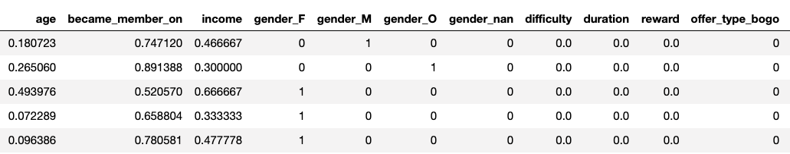
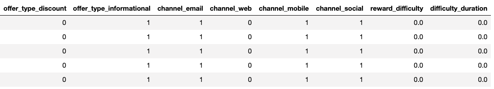

### Problem Statement

I chose to build a model that predicts whether or not a customer will complete an offer, meaning that the customer will receive a offer, view the offer and finish the offer before expire day. Thus, to solve this problem, I will establish a binary classifier.  

One potential solution has 3 steps:
1. Preprocess combined transaction, demographic and offer data. This dataset describes an offer’s attributes, the user's demographic data and whether the offer was successful. Also, split datasets into train and test datasets.    
2. Training XGBoost Model as benchmark model.  
3. Training PyTorch deep learning model and improve the results.  

### Metrics

The evaluation metric is the Receiver Operating Characteristic Curve (ROC AUC) score from prediction scores. It computes area under the Receiver Operating Characteristic Curve. This will quantify the performance of both the benchmark model and the solution model. The reason is that the datasets are balanced and also, we only care about the final class predictions and we don’t want to tune threshold.  

## Analysis

### Data Exploration and Visualization

#### Portfolio Data
This dataset is about offers sent during 30-day test period. There are totally 10 offers. 4 of them are BOGO, 4 are discount and 2 are informational. All offers are distributed via email. By contrast only 6 offers are showed in social networks. 

#### Profile Data
This dataset describes rewards program users, 17000 users totally. 

We show customers' age in the interval of 5 years. The missing value is encoded as 118, which is more than 2000 data points. Most of the customers fall in the age range from 50 to 60 years old.  
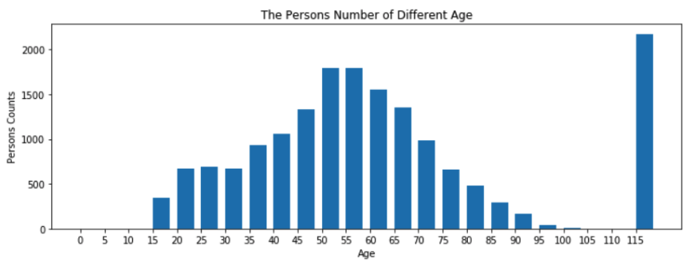

Most of the customers fall in the income range between 50000 and 60000. The income ranges from 40000 to 120000. 

As for gender, there are two other categories than female and male. Male customers are more than female customers and gender O is smallest in number.  
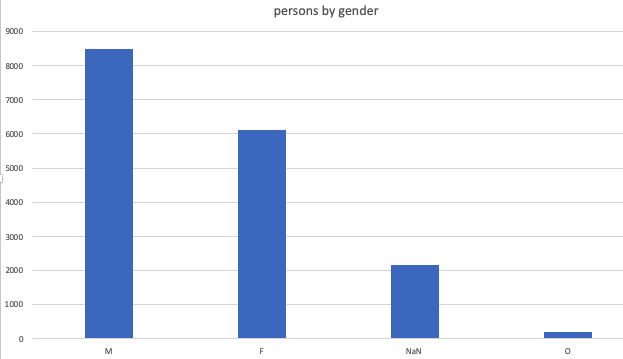

Member grows by year and get to the peak at 2017. The plot suggest that most customers recently joined the rewards program. 
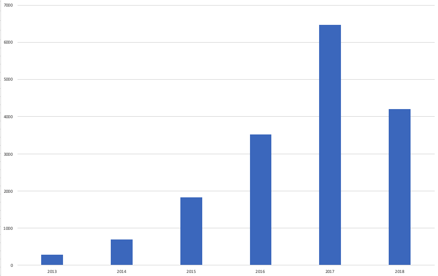

#### Transcript Data  
This dataset contains event log. There are 306648 events. Similarly, we will explore insights of transactions.  

There are four events, offer received, offer viewed, transaction, offer completed. We could see the amount of completed offer is around half of that of offer received. Offer viewed is a bit lower than offer received. It hints the dataset would not be perfectly balanced.  
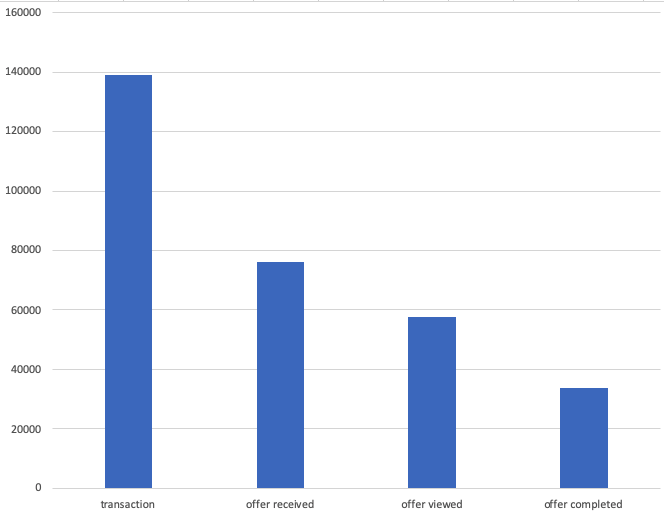

When discovering this dataset, we do see some abnormalities. For example, offer type informational usually don't have a complete event. See below summary for one person. 

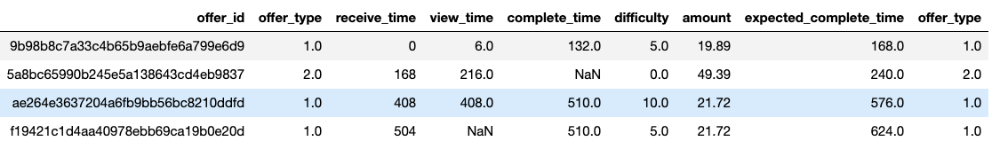

The second row shows after viewing this offer, a user spends 49.39 dollars. We think such behavior should be consider a success offer, thus we adjust the class to completed offer.  
We also see behavior like no money spent after viewing informational offer. We don't category this to completed offer. Example is provieded following:

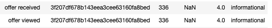

According to the instruction of this project, we should not consider offer complete if people didn't view it. See below to find this case.  

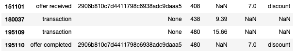

We could clearly see the offer id `290` is received and completed without view event. However, we see interesting behavior like offer viewed after offer completed. See below records:

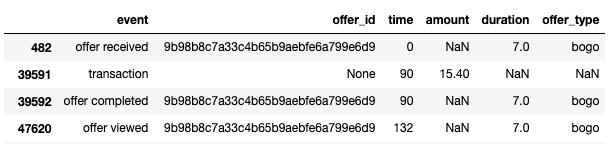

The offer is viewed after completion. We also observe that the time offer viewed is still in valid duration and amount after offer received exceed difficulty (required amount). We consider this case also completed offer because customer may see the offer summary (not detail) and didn't take any response to it timely. But we don't consider the offer is completed if any requirements such as duration or difficulty are satisfied. 

### Algorithms and Techniques

Our solution for this problem is a custom PyTorch neural network classifier. Neural networks are a kind of supervised learning model. It computes systems that are inspired by, but not necessarily identical to, the biological neural networks that constitute animal brains. Such systems "learn" to perform tasks by considering examples, generally without being programmed with any task-specific rules.
Our model will have one hidden layer between input and output layer. And nodes are fully connected with linear regression model. The output layer go through [sigma function](https://en.wikipedia.org/wiki/Divisor_function) to produce scalar value. See below image for the graph:

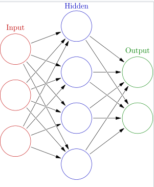

There are other factors impact our model such as dropout, optimizer and criterion. A dropout function is added because we would like to avoid over-fitting. In training process, some data points may drop out with a certain probability. We use Adam Optimizer which is a common one in PyTorch. The object of using an optimizer is that We want the model to get trained to reach the state of maximum accuracy given resource constraints like time, computing power, memory etc. As for loss function, we choose [BCEloss](https://pytorch.org/docs/stable/nn.html#bceloss) which measures the Binary Cross Entropy between the target and the output. 

### Benchmark

We use XGBoost model as benchmark. Hyperparameters are 
- max_depth = 5,
- eta = 0.2,
- gamma = 4,
- min_child_weight = 6,
- subsample = 0.8,
- objective = 'binary:logistic',

The ROC-AUC score is 0.71594. This result will be used as the threshold to determine the improvement of solution model of which the ROC-AUC score is higher.  

## Methodology
### Data Preprocessing
In this section, we will preprocess three datasets and deal with abnormalities data points and combine them to the dataset which will be used for training and testing models. The development codes are in `starbucks` notebook and in scripts folder.    
  
#### Portfolio Dataset
In this dataset, we found two columns are category data, `offer_type` and `channels`. We first break out these two columns by using [one hot encoding](https://hackernoon.com/what-is-one-hot-encoding-why-and-when-do-you-have-to-use-it-e3c6186d008f). Second, all columns are numeric data except id and columns like difficulty, reward are measured on different scales comparing to one hot encoding columns. We adjust those values by performing [normalization](https://en.wikipedia.org/wiki/Normalization_(statistics)) on them. Third, since we do normalization, we may lose value as being absolute value. We add two more features, that is, the ratio of reward against difficulty and the ratio of difficulty against duration. The former represents the ratio of return by completing an offer. You could image the higher the value, the higher probability a custom tend to response it. The latter shows the ratio of on average how much to pay to finish an offer. The lower is more attractive. The below image shows the processed portfolio dataset. There are 10 features.   

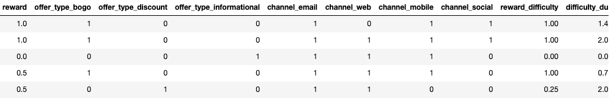

#### Profile Dataset
As for profile, similar to portfolio dataset, we have one category column, `gender`. We apply one hot encoding to this column. Then, we need to deal with `NaN` in income and age. We choose median to fill in because we saw the distribution of those two columns are skewed so that median maybe a better choice than average. Next, we have a date type column, become_member_on. This value matters but the actual value is not necessary. We convert the data to unix timestamp so we only keep the distance in timeline. Lastly, all columns are numeric now. They need be in same scale. Thus, we do normalization on all columns. Here is the processed dataset.  

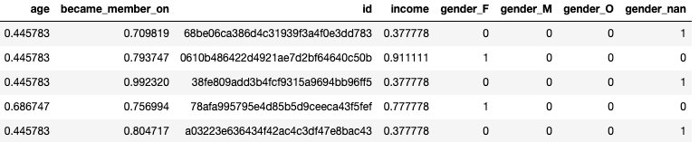

#### Transcript Dataset
In terms of transcript, our goal is to create a label dataset. First of all, we need clean this dataset. We saw a complex dictionary data structure in value column so that the value column breaks out into two columns, offer_id and amount (we don't care reward here). Then, we need combine transcript and portfolio dataset because we need difficulty, duration and offer type to help judge if an offer is completed or not. Next, we have a `process_one_customer_transcript`. In this method, first step is to group by person and offer and calculate amount spent, receive time, view time, expected complete time and complete time (see detailed comments in scripts/process_transcript.py). We follow several rules to tell an offer is completed,
1. if offer has received event, viewed event and completed event in order.
2. if offer has received event, completed event and viewed event in order and viewed event happened before expire date and amount spent is reached. 
3. if offer is informational and offer has received event and view event and also they happened before expire date and amount spent is reached.  

The follow is processed transcript dataset. The final column is label column, which will then convert to integer. 1 is complete while 0 is incomplete. 

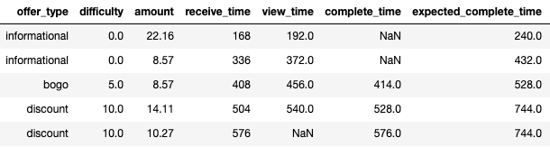
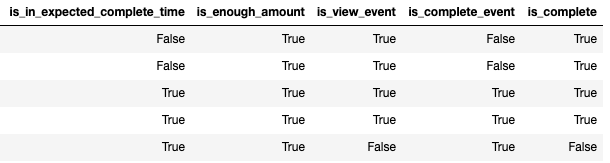

#### Combined Dataset

We need a combined dataset for model feeding. This final dataset is achieved using pandas merge functionality. We also removed useless columns such as offer id, person id and extra columns in transcript. In the end, there are 76277 data points and 19 features: is_complete, age, became_member_on, income, gender_F, gender_M, gender_O, gender_nan, difficulty, duration, reward, offer_type_bogo, offer_type_discount, offer_type_informational, channel_email, channel_web, channel_mobile, channel_social, reward_difficulty, difficulty_duration. 

#### Train and Test Dataset

We wrote a `train_test_split` split the whole dataset into train and test datasets with decimal fraction `0.7` and random seed `666`. Thus, the dataset could be reproduced. 

### Implementation

This section will state detailed implementation step by step:

1. Load data to S3. The data includes train.csv and test.csv files with features and class labels we prepared in previous section. The reason is SageMaker estimater will normally read data from S3. 
2. Modeling
   1. Define NN model(see detail in pytorch/model.py). Since we use PyTorch neural network, we need define the network graph in forward method. Here we use two layers network and the output layer is a sigmod function which produce one dimensional data. 
   2. Write a train script (see detail in pytorch/train.py). A train program is needed because this model is customized one. In this script, we load training data, parse hyperparameters, initialize the customized model, train this model and finally save model articles for later deployment and predictions.  
   3. Create an estimator. Still, a custom SageMaker estimator is created with specified entry point which is the model.py in pytorch file. In this step, we give hyperparameters, 30 hidden dim, to evaluate the model. 
   4. Train the estimator with train data in S3.  
   5. Deploy the trained model. `pytorch/predict.py` file as an entry point.
3. Evaluate the trained model. After the model is deployed, we could simply call predict method to get the result. And then we use roc_auc_sore function from sklearn metrics to calculate the metric `ROC AUC` score. 
4. Hyperparameter tuning. In this stage, we choose different options for hyperparameters, such as lower hidden dim, increase epochs and modify drop rate, etc. We chose a model with lowest loss value. 
5. Evaluate best trained model. Similar to previous evaluation. We evaluate test with best trained model.  
6. Clean up Resources including entrypoints, S3 files and unless files in SageMaker notebook. 

### Refinement

We refine the model by tuning hyperparameters. We have two configurable parameters. Adding hidden dimensions could help capture changes on different dimensions. We could see this change would help reduce the loss value a lot. Epochs is another essential parameter. It controls how many iterators to improve the model based on loss function. We could see longer epochs will help increase the final score. Drop out is more avoiding over-fitting. Since our goal is to achieve better score. We here reduce the number a little bit to reflect a better performance. 

From below table, we could clearly see the model's score increasing from 0.7052 to 0.7343. Also, it beats the number of XGBoost model.  

| hidden dim | epochs | drop out | loss value | ROC AUC | 
| ---        | ---    | ----     | ---        | ---     |
| 30         | 100    | 0.25     | 0.5635     | 0.6952  |
| 15         | 100    | 0.25     | 0.5717     | 0.7056  |
| 15         | 200    | 0.25     | 0.5708     | 0.7111  |
| 100        | 100    | 0.15     | 0.4545     | 0.7605  |
| 190        | 200    | 0.15     | 0.4426     | 0.7843  | 

## Results

This section will discuss the final model's qualities and metric result. Also, we will compare the result to that of our benchmark model. 

### Model Evaluation and Validation

Final model is a PyTorch neural network model with 
- hidden dimensions = 190, 
- epochs = 200
- drop out = 0.15

In order to show the robustness of this model, I also randomly generate other test datasets with same size of data points from the whole datasets. We could see the ROC AUC score are stable at around 0.78. The loss value is similar across datasets. 

| hidden dim | epochs | drop out | loss value | ROC AUC | 
| ---        | ---    | ----     | ---        | ---     |
| 190        | 200    | 0.15     | 0.4426     | 0.7843  | 
| 190        | 200    | 0.15     | 0.4519     | 0.7845  | 
| 190        | 200    | 0.15     | 0.4403     | 0.7819  | 

### Justification

The final model above shows a better score than XGBoost. In number, 0.78 vs 0.71. The improvement is not that big, but is already significate boost. Actually we also try a little bit fewer hidden dim and epochs like 150 and 180 respectively. The score didn't go down dramatically. Thus, the model is to adequately solve the problem.  

## Reference:
1. [Pytorch tutorial](https://pytorch.org/tutorials/beginner/blitz/cifar10_tutorial.html)
2. [Pytorch NN](https://pytorch.org/tutorials/beginner/blitz/neural_networks_tutorial.html)
3. [Artificial Neural Network](https://en.wikipedia.org/wiki/Artificial_neural_network)
4. [Pytorch dropout](https://pytorch.org/docs/stable/_modules/torch/nn/modules/dropout.html)
5. [Pytorch Adam](https://pytorch.org/docs/stable/_modules/torch/optim/adam.html)
6. [BCEloss](https://pytorch.org/docs/stable/nn.html#bceloss)
7. [Hyperparameter tuning](https://towardsdatascience.com/hyperparameter-tuning-c5619e7e6624)
8. [Hyperparameter optimization](https://en.wikipedia.org/wiki/Hyperparameter_optimization)
